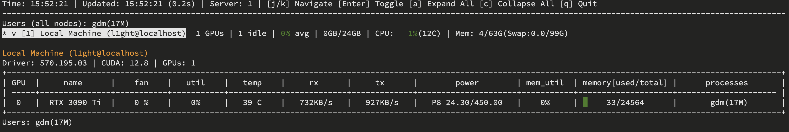
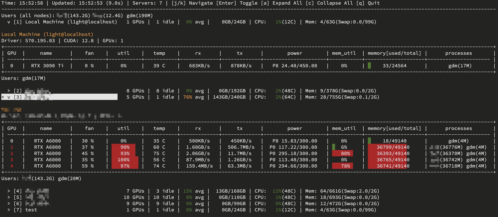
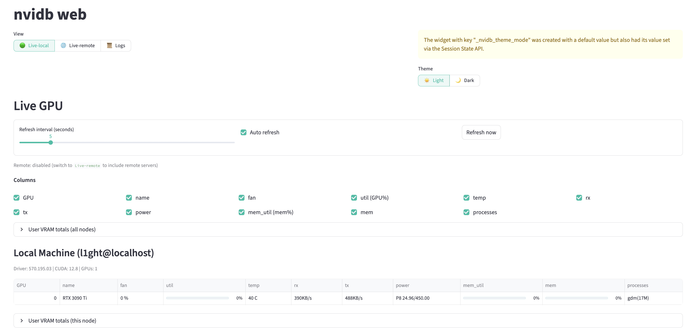
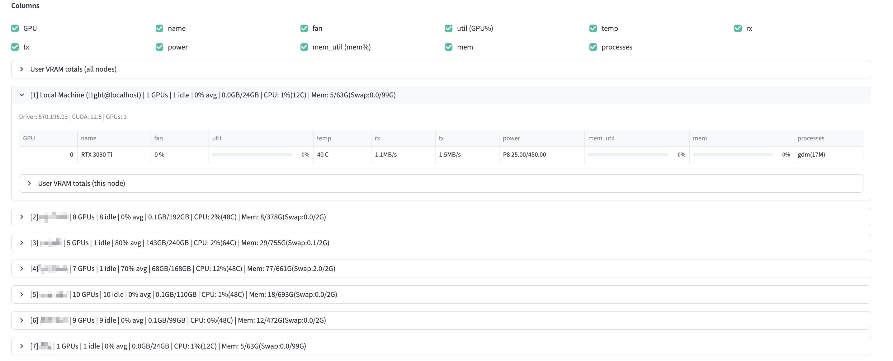

# nvidb

A package that provides an aggregated view of the NVIDIA GPU information on several hosts.

## 1. Installation

### 1.1 Install using `pip`

You can install `nvidb` using pip. First, clone the repository:

```bash
git clone https://github.com/FanBB2333/nvidb.git
cd nvidb
pip install .
```

Or install directly from PyPI:

```bash
pip install nvidb
# If the specified version is unavailable in your custom repository, use pypi.org as the source:
pip install nvidb -i https://pypi.org/simple
```

---

### 1.2 Configuration

#### Option A: Interactive Setup (Recommended)

Use the interactive command to add servers:

```bash
nvidb add
```

This will guide you through adding a new server with prompts for host, port, username, authentication method, etc.

#### Option B: Manual Configuration

To manually configure remote servers, create or edit the configuration file at `~/.nvidb/config.yml`:

```bash
mkdir -p ~/.nvidb/
cp config.example.yml ~/.nvidb/config.yml
# Edit the file with your server details
```

Configuration file [template](config.example.yml):

```yaml
servers:
  - hostname: "example1.com"       # Server hostname or IP address
    port: 22                       # SSH port number
    username: "user1"              # SSH username for authentication
    nickname: "Production GPU"     # Human-readable nickname for display
    auth: "auto"                   # Authentication method: auto | key | password
    identityfile: "~/.ssh/id_ed25519"  # Optional, used only when auth is auto/key
```

**Configuration Options:**
- `hostname`: Server hostname or IP address (required)
- `port`: SSH port, default is 22 (required)
- `username`: SSH username (required)
- `nickname`: Human-readable server nickname (optional)
- `auth`: Authentication method - `auto`, `key`, or `password` (optional, default: `auto`)
- `identityfile`: SSH private key path (optional, only effective when `auth` is `auto` or `key`)
- `password`: SSH password (optional, will prompt if needed)

> **Warning**: Storing passwords in plaintext in the configuration file is **NOT RECOMMENDED** for security reasons. Consider using SSH key-based authentication (`auth: key`) instead.

#### Environment Variables

You can customize the working directory by setting `NVIDB_HOME`:

```bash
export NVIDB_HOME=/path/to/custom/nvidb
```

Default working directory is `~/.nvidb/`.

---

## 2. Usage

### 2.1 Basic Commands

```bash
nvidb                  # Monitor local GPU only (interactive TUI)
nvidb --remote         # Monitor local and remote servers
nvidb --once           # Print GPU stats once and exit
nvidb --once --remote  # Print all servers once and exit
nvidb --version        # Show version
```

### 2.2 Server Management

```bash
nvidb add              # Interactively add a new server
nvidb import [path]    # Import servers from SSH config (default: ~/.ssh/config)
nvidb info             # Show configuration info and server list
```

### 2.3 GPU Logging

Continuously log GPU statistics to an SQLite database:

```bash
nvidb log                          # Log local GPU with default settings
nvidb log --remote                 # Log local and remote GPUs
nvidb log --interval 10            # Set logging interval to 10 seconds
nvidb log --db-path /path/to/db    # Specify custom database path
```

Press `Ctrl+C` to stop logging and save data.

### 2.4 Web Dashboard

Open a Streamlit-based web dashboard to view live GPU info and browse log sessions:

```bash
pip install streamlit
nvidb web                 # Web dashboard (Live + Logs)
nvidb web --db-path /path/to/db
nvidb web --port 8502
```

After the server starts:
- Switch to `Logs` and select a session from the left sidebar.
- Use `Live-local` / `Live-remote` in the UI to toggle local-only vs local+remote live stats (remote is loaded only when `Live-remote` is selected).
- Use `Theme` to switch `Light` / `Dark`.

`nvidb log web` is deprecated; use `nvidb web` instead.

### 2.5 Cleanup

Remove server configurations or delete log data:

```bash
nvidb clean              # Interactive cleanup menu
nvidb clean all          # Delete all data (requires double confirmation)
```

### 2.6 Interactive TUI Navigation

When viewing GPU stats, use these keyboard shortcuts:

| Key               | Action                        |
| ----------------- | ----------------------------- |
| `j` / `↓`         | Move selection down           |
| `k` / `↑`         | Move selection up             |
| `Enter` / `Space` | Toggle expand/collapse server |
| `a`               | Expand all servers            |
| `c`               | Collapse all servers          |
| `q`               | Quit                          |

### 2.7 GPU Monitor Decorator

Use the `@nvidb.monitor` decorator to track GPU usage during function execution:

```python
import nvidb

@nvidb.monitor
def train_model():
    # Your training code here
    pass

# With custom options
@nvidb.monitor(sample_interval=0.05, gpu_indices=[0, 1])
def multi_gpu_training(epochs: int = 100):
    pass

# Async function support
@nvidb.monitor
async def async_training():
    pass
```

After function execution, it outputs:
```
======================================================================
[nvidb.monitor] Function completed: train_model
  Signature: train_model()
  Location: /path/to/file.py:14
----------------------------------------------------------------------
  Duration: 125.3s
----------------------------------------------------------------------
  GPU 0: NVIDIA GeForce RTX 3090 Ti
    Memory:
      Peak:    8192.00 MiB / 24.00 GiB
      Delta:   +6144.00 MiB
    Utilization:
      Avg:     85.0%
    Temperature:
      Peak:    72C
    Power:
      Peak:    320.5W
======================================================================
```

**Decorator Options:**
- `sample_interval`: Sampling interval in seconds (default: 0.1)
- `gpu_indices`: List of GPU indices to monitor (default: all GPUs)
- `enabled`: Enable/disable monitoring (default: True)

---

## 4. System Requirements

- NVIDIA driver installed with `nvidia-smi` available in terminal
- Python 3.8+
- SSH access to remote servers (for remote monitoring)

## 5. Tips

- Use `nvidia-smi --help-query-gpu` to see available query options
- Database files are stored in `~/.nvidb/gpu_log.db` by default
- Configuration and logs are stored in `~/.nvidb/` directory

## 6. Show me the screenshots

- Monitor local info with `nvidb`:



- Monitor remote info with `nvidb --remote`:



- Monitor on web panel with `nvidb web`:

Local info:



Remote info:



---

## 7. Acknowledgements

- Thanks to NVIDIA for providing the `nvidia-smi` tool, which is used to query GPU information.
- Thanks to [nvidia-ml-py](https://pypi.org/project/nvidia-ml-py) (`pynvml`) for Python bindings to NVML, used by the `@nvidb.monitor` decorator.
- Thanks to [Paramiko](https://github.com/paramiko/paramiko) for powering SSH connections for remote monitoring.
- Thanks to [PyYAML](https://github.com/yaml/pyyaml) for YAML-based configuration loading and saving.
- Thanks to [pandas](https://github.com/pandas-dev/pandas) for parsing and processing GPU stats and log data.
- Thanks to [blessed](https://github.com/jquast/blessed) for building the interactive terminal UI.
- Thanks to [termcolor](https://github.com/termcolor/termcolor) for colored terminal output.
- Thanks to [Streamlit](https://github.com/streamlit/streamlit) for providing the web dashboard framework.

