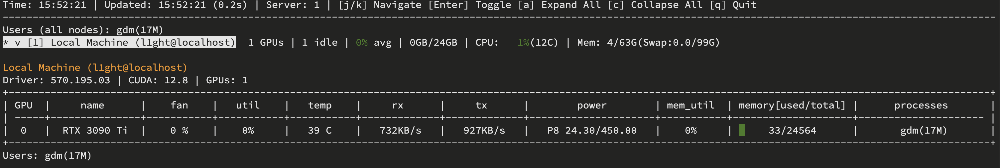
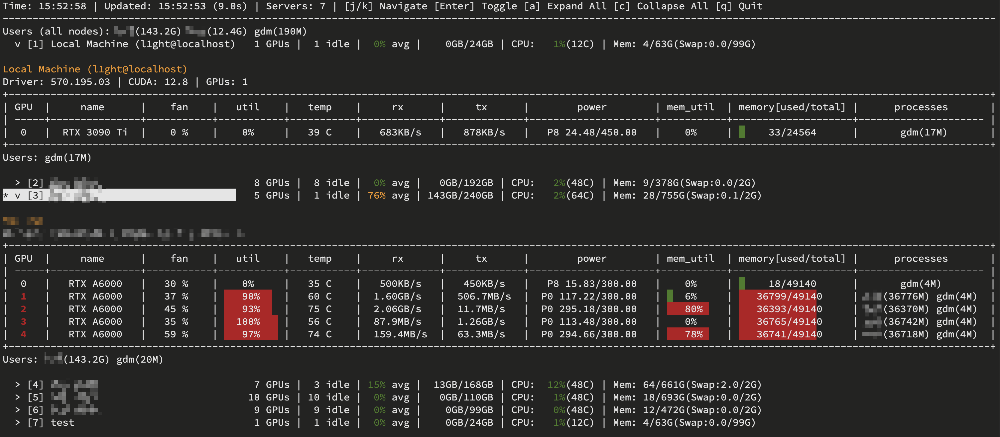
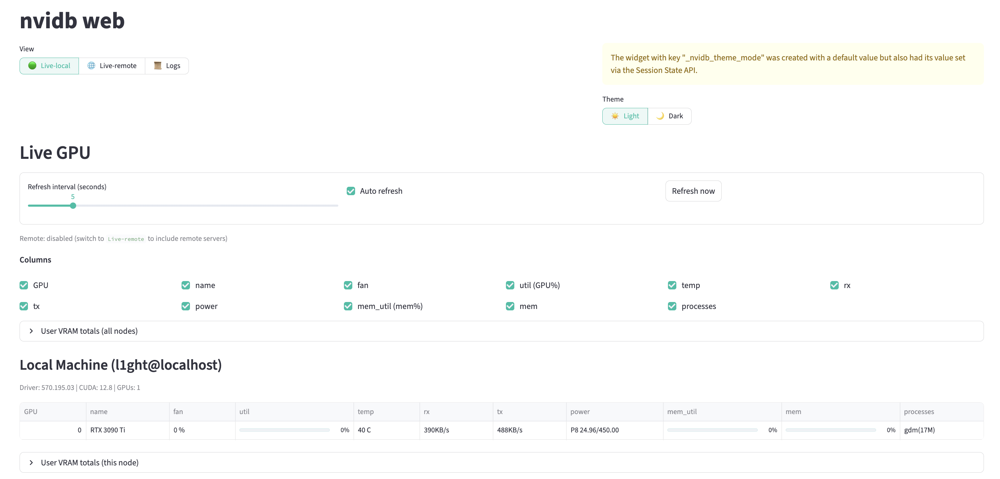
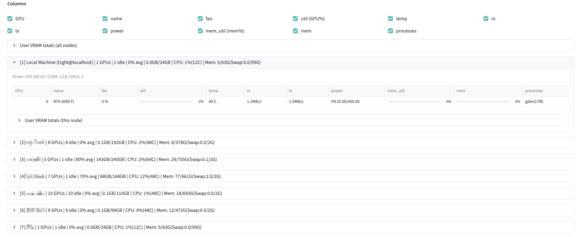

# nvidb

A package that provides an aggregated view of the NVIDIA GPU information on several hosts.

## 1. Installation

### 1.1 Install using `pip`

You can install `nvidb` using pip. First, clone the repository:

```bash
git clone https://github.com/FanBB2333/nvidb.git
cd nvidb
pip install .
```

Or install directly from PyPI:

```bash
pip install nvidb
# If the specified version is unavailable in your custom repository, use pypi.org as the source:
pip install nvidb -i https://pypi.org/simple
```

---

### 1.2 Configuration

#### Option A: Interactive Setup (Recommended)

Use the interactive command to add servers:

```bash
nvidb add
```

This will guide you through adding a new server with prompts for host, port, username, authentication method, etc.

#### Option B: Manual Configuration

To manually configure remote servers, create or edit the configuration file at `~/.nvidb/config.yml`:

```bash
mkdir -p ~/.nvidb/
cp config.example.yml ~/.nvidb/config.yml
# Edit the file with your server details
```

Configuration file [template](config.example.yml):

```yaml
servers:
  - hostname: "example1.com"       # Server hostname or IP address
    port: 22                       # SSH port number
    username: "user1"              # SSH username for authentication
    nickname: "Production GPU"     # Human-readable nickname for display
    auth: "auto"                   # Authentication method: auto | key | password
    identityfile: "~/.ssh/id_ed25519"  # Optional, used only when auth is auto/key
    proxyjump: "login.example.com" # Optional OpenSSH ProxyJump host or alias
```

**Configuration Options:**
- `hostname`: Server hostname or IP address (required)
- `port`: SSH port, default is 22 (required)
- `username`: SSH username (required)
- `nickname`: Human-readable server nickname (optional)
- `auth`: Authentication method - `auto`, `key`, or `password` (optional, default: `auto`)
- `identityfile`: SSH private key path (optional, only effective when `auth` is `auto` or `key`)
- `password`: SSH password (optional, will prompt if needed)
- `proxyjump`: OpenSSH jump host, alias, or comma-separated chain (optional; for
  example `login` or `login-a,alice@login-b:2222`)

> **Warning**: Storing passwords in plaintext in the configuration file is **NOT RECOMMENDED** for security reasons. Consider using SSH key-based authentication (`auth: key`) instead.

`proxyjump` uses the local OpenSSH client, so aliases and credentials configured
in `~/.ssh/config` are reused. Connect to the jump host once with `ssh login` to
accept its host key and verify key/agent authentication before running the
non-interactive job queue. `nvidb import` copies `ProxyJump` from OpenSSH config:

```sshconfig
Host login
    HostName login.example.com
    User jump-user

Host training-a100
    HostName 10.0.0.42
    User gpu-user
    ProxyJump login
```

```bash
nvidb import
nvidb --remote
```

The same file also holds a `view` section that nvidb maintains itself. Persistent
layout keys (`v`, `d`, `s`, `f`, `g`, `u`, `t`, and `p` in single-line mode)
write the new state back so the next run opens with the same view. Pane focus and
the temporary Detailed-mode process collapse are not persisted. See
[2.6 Interactive TUI Navigation](#26-interactive-tui-navigation) for what each
setting does.

#### Environment Variables

You can customize the working directory by setting `NVIDB_HOME`:

```bash
export NVIDB_HOME=/path/to/custom/nvidb
```

Default working directory is `~/.nvidb/`.

---

## 2. Usage

### 2.1 Basic Commands

```bash
nvidb                  # Monitor local GPU only (interactive TUI)
nvidb --remote         # Monitor local and remote servers
nvidb --once           # Print GPU stats once and exit
nvidb --once --remote  # Print all servers once and exit
nvidb --version        # Show version
```

> **Tip**: Set `remote: true` under the `basic` section of `~/.nvidb/config.yml` to make plain `nvidb` include remote servers by default (same for `nvidb log`). Pass `--no-remote` for a one-off local-only run.

GPU status is collected directly from NVML. Local collection uses `nvidia-ml-py`;
remote collection keeps a standard-library Python agent open over SSH and calls
`libnvidia-ml.so.1` directly, so no Python package needs to be installed on the
remote host. `nvidia-smi -q -x` is retained only as a compatibility fallback when
NVML cannot be initialized.

### 2.2 Server Management

```bash
nvidb add              # Interactively add a new server
nvidb import [path]    # Import servers from SSH config (default: ~/.ssh/config)
nvidb info             # Show configuration info and server list
```

### 2.3 GPU Logging

Continuously log GPU statistics to an SQLite database:

```bash
nvidb log                          # Log local GPU with default settings
nvidb log --remote                 # Log local and remote GPUs
nvidb log --interval 10            # Set logging interval to 10 seconds
nvidb log --db-path /path/to/db    # Specify custom database path
```

Press `Ctrl+C` to stop logging and save data.

### 2.4 Web Dashboard

Open a [Dash](https://github.com/plotly/dash)-based interactive web dashboard to view live GPU info and browse log sessions:

```bash
pip install dash
nvidb web                 # Web dashboard (Live + Logs)
nvidb web --db-path /path/to/db
nvidb web --port 8502
```

After the server starts (http://localhost:8501 by default):
- **Live**: per-server GPU tables plus rolling utilization / VRAM charts; toggle `include remote`, pick the refresh interval, or pause auto-refresh. (`basic.remote: true` or `nvidb --remote web` enables remote by default.)
- **Logs**: pick a session in the left table, then filter by node / metric / time range. Charts support zoom, pan and legend isolation; **click any chart point to inspect that snapshot**. The raw table supports filtering, sorting and CSV export.

`nvidb log web` is deprecated; use `nvidb web` instead.

### 2.5 Cleanup

Remove server configurations or delete log data:

```bash
nvidb clean              # Interactive cleanup menu
nvidb clean all          # Delete all data (requires double confirmation)
```

### 2.6 Interactive TUI Navigation

When viewing GPU stats, use these keyboard shortcuts:

| Key               | Action                        |
| ----------------- | ----------------------------- |
| `v`               | Switch unified/per-node view  |
| `d`               | Toggle unified row detail     |
| `s`               | Cycle unified GPU sorting     |
| `f`               | Cycle unified GPU filters     |
| `g`               | Toggle unified per-node grouping |
| `u`               | Show/hide nodes without GPU support |
| `t`               | Toggle GPU and selected-process history |
| `Enter` / `Space` / `l` / `→` | Show and enter the selected GPU's process pane |
| `h` / `←`         | Return focus to the GPU/node pane |
| `Tab`             | Switch between visible GPU and process panes |
| `p`               | Show/hide the selected GPU's process pane |
| `j` / `↓`         | Move the active-pane selection down |
| `k` / `↑`         | Move the active-pane selection up |
| `PgUp` / `PgDn`   | Move the active-pane selection by a page |
| `[` / `]`         | Page through a long wrapped command |
| `/`               | Edit a live process filter |
| `o` / `F6`        | Cycle process sorting |
| `O`               | Reverse the current process sort |
| `+` / `-`         | Show more/fewer process rows |
| `i` / `T` / `K`   | Arm SIGINT / SIGTERM / SIGKILL for the selected process |
| `Esc`             | Cancel a signal or clear the process filter |
| `?`               | Open context-sensitive help |
| Mouse             | Select rows, sort headers, click actions, or scroll either pane |
| `Enter` (signal armed) | Confirm the pending process signal |
| `Enter` / `Space` (per-node view) | Toggle the selected server details |
| `a`               | Expand all servers            |
| `c`               | Collapse all servers          |
| `q`               | Quit                          |

The default per-node view keeps each server's summary and expandable detail
table. The unified view places GPUs from every node in one table. By default,
single-line rows are grouped into per-node blocks: a band names the node in
bold cyan followed by its hostname/IP, GPU count, free GPUs, average
utilization, and VRAM, with a dim rule filling the rest of the line. The rows
below it drop the redundant `Node` / `Hostname/IP` columns so more width goes
to the GPU metrics. Press `g` to turn grouping off (or sort by anything other
than node order) and the flat table with `Node` and `Hostname/IP` columns comes
back.
Detailed cards include node identity themselves and omit the redundant band.
Columns adapt to the terminal width, with core identity, utilization, model, and
VRAM fields kept ahead of secondary metrics.
In the unified view, press `d` to switch between the single-line table and
Detailed cards. Each card is divided into four labelled rows: `GPU` identity,
`LOAD`, `MEM/TEMP`, and `I/O`. Utilization and VRAM gain block bars on terminals
at least 100 columns wide. The palette stays deliberately quiet: grey for
structure and secondary values, cyan for the active focus and normal metrics,
and yellow/red for warnings. Green is reserved for a running/healthy state.
The node name comes before the GPU index so the machine is the first thing you
read.
The capacity line summarizes available and busy GPUs, average utilization, and
used/total/free VRAM. Press `s` to cycle between node order, available GPUs
first, and highest utilization first. A GPU is considered available when its
utilization is below 5% and its VRAM usage is below 10%.
Unified pages are sized from the current terminal height. The title shows the
current focus and visible GPU range, and `›` marks the active selection.
Press `f` to cycle through all, available, busy, and error-only views. Busy
means at least 50% GPU utilization. Error-only mode hides GPU rows and lists
nodes whose latest refresh failed. Because the filter is restored from the
config on the next run, a warning line above the table spells out how many GPUs
it is hiding.
Detailed mode places the selected GPU's process pane directly below the cards;
there is no separate drill-down screen. `Enter`, `Space`, `→`, or `l` shows the
pane when necessary and moves focus into its task list. Repeating one of these
keys keeps process focus instead of collapsing the pane. Press `p` to hide or
show it explicitly; `←` or `h` returns to GPU/node selection without hiding it.
The same navigation applies in single-line mode. The process table shows PID,
user, process VRAM, percentage of total GPU VRAM, CPU%, host MEM%, RSS, elapsed
time, state, and command. Narrow terminals discard secondary columns first. The
selected process gets an htop-style low-contrast grey background, and its block
below the table spells out both percentage of the whole GPU and percentage of
currently used GPU memory, threads, state, elapsed time, and the complete
wrapped command line.
Press `/` to filter the process list as you type. The query matches PID, user,
type, state, process name, and the full command. `Enter` keeps the current
filter and leaves edit mode; `Esc` clears it. Press `o` or `F6` to cycle through
VRAM, CPU, host memory, RSS, elapsed time, PID, and command sorting. Uppercase
`O` reverses the current order. The visible table headers are also clickable:
click a field once to sort by it and again to reverse it.
Use `+` and `-`, or the row controls in the action bar, to change how many
processes stay visible. The request is capped at 12 rows and reduced
automatically when the selected-process details need the space.
When a wrapped command would push the action bar off-screen, it automatically
uses height-aware pages (at most five command lines on terminals shorter than
28 rows). Use `[`/`]`, the clickable command buttons, or the wheel over the
command to see every line.

Use `Enter`, `→`, or `l` to enter process focus, `←` or `h` to return to
GPU/node focus, and `Tab` to switch between visible panes. Then use `j`/`k` or
the arrow keys to move the highlighted row. The active pane uses solid borders;
the inactive pane uses dashed borders. Only the active pane displays a
selected-row background, so process rows are not highlighted while GPU/node
selection has focus. Mouse reporting is on by default: click any GPU card or
process row to select it, use the wheel over either pane to scroll that pane,
and click the action buttons directly. Most terminals need `Shift` (or
`Option`) held down for their own drag-to-select while mouse reporting is
active; set `mouse: false` under `view` to disable TUI mouse handling.

The process action bar exposes `SIGINT`, `SIGTERM`, and `SIGKILL` as `i`, `T`,
and `K`. Every signal requires a second identical click/key press or `Enter`
within five seconds; `Esc` cancels it. Signals run on the node that owns the
selected GPU and report permission or command failures in the pane. If
GPU/node selection has focus, the first signal key only transfers focus to the
process pane; press it again to arm the action.

Press `?` for a help panel tailored to the current per-node, GPU, or process
focus. Click anywhere inside the panel, or press `?`, `Esc`, or `q`, to close
it. Closing help with `q` does not quit the monitor.

Press `t` (or click History) to show utilization, VRAM, and temperature for the
selected GPU plus CPU, GPU VRAM share, host memory, and RSS for the selected
process. Both histories retain the latest 60 successful refresh samples in
memory and do not add remote requests. On terminals shorter than 36 lines, the
history rows temporarily replace the selected process's command block so the
action buttons remain visible; toggle History off to restore the command.

Machines without NVIDIA GPUs (a macOS laptop, a CPU-only host) are not expanded
by default in the per-node view and are collapsed into a single "hidden" line in
the unified node status. Press `u` to show them.
Layout toggles are written back to the `view` section of `~/.nvidb/config.yml`,
so the next `nvidb` run starts with the same layout. Process filters, sorting,
row counts, and help visibility are session-only.

### 2.7 GPU Monitor Decorator

Use the `@nvidb.monitor` decorator to track GPU usage during function execution:

```python
import nvidb

@nvidb.monitor
def train_model():
    # Your training code here
    pass

# With custom options
@nvidb.monitor(sample_interval=0.05, gpu_indices=[0, 1])
def multi_gpu_training(epochs: int = 100):
    pass

# Async function support
@nvidb.monitor
async def async_training():
    pass
```

After function execution, it outputs:
```
======================================================================
[nvidb.monitor] Function completed: train_model
  Signature: train_model()
  Location: /path/to/file.py:14
----------------------------------------------------------------------
  Duration: 125.3s
----------------------------------------------------------------------
  GPU 0: NVIDIA GeForce RTX 3090 Ti
    Memory:
      Peak:    8192.00 MiB / 24.00 GiB
      Delta:   +6144.00 MiB
    Utilization:
      Avg:     85.0%
    Temperature:
      Peak:    72C
    Power:
      Peak:    320.5W
======================================================================
```

**Decorator Options:**
- `sample_interval`: Sampling interval in seconds (default: 0.1)
- `gpu_indices`: List of GPU indices to monitor (default: all GPUs)
- `enabled`: Enable/disable monitoring (default: True)

---

## 3. Cluster Job Queue

`nvidb queue` adds a small slurm-like scheduler on top of the servers already in
`config.yml`. Jobs are submitted from any machine that can SSH to the nodes, wait
until a GPU has room for them, run detached on the node, and report back.

The queue's only shared state is one SQLite file (`~/.nvidb/queue.db`). Several
independent clients — several Claude Code sessions, a script, an open TUI —
coordinate purely by reading and writing that file, so none of them has to stay
running for the queue to work.

### 3.1 How it schedules

There is no daemon. Any command that touches the queue performs a **tick**:
probe every node, settle finished jobs, then place whatever now fits. Ticks are
rate-limited and guarded by a lease, so a burst of concurrent clients results in
one round of SSH traffic rather than one per client. The open TUI ticks on a
timer, and `nvidb queue tick --watch 10` gives you a background ticker if you
want one.

GPUs are allocated by **VRAM budget**, not whole cards:

```
free = total − memory used by non-queue processes − reservations of queue jobs − headroom
```

Counting foreign processes is what lets the queue share machines with work you
started by hand: a card that someone else has filled simply reports no capacity,
and jobs go elsewhere until it frees up. A job is charged the larger of what it
reserved and what it actually uses, so understating `--vram` cannot oversubscribe
a card. CPU-only jobs (`--gpus 0`) reserve nothing, so they are bounded by a
count instead: `max_cpu_jobs_per_node`, four by default.

A job cancelled or timed out while its node was unreachable keeps its record
final but its process alive. The pid is remembered separately from the job — it
has to outlive both `job requeue` and `job purge` — and the first probe that
reaches that node again kills it, provided the pid is still running that job's
`run.sh`. `nvidb queue status --json` reports how many such cleanups are
outstanding as `pending_reaps`.

On nodes where the driver accounts for none of the memory in use — WSL, where
the GPU is driven from Windows, and which either names no processes at all or
names them without memory figures — the split between foreign work and the
queue's own jobs cannot be measured. Those GPUs are marked `blind` and their own
jobs are credited up to their reservation, which keeps the queue from charging a
job twice.

### 3.2 What is on the GPUs

The queue's own bookkeeping is only half the picture: these are workstations,
and most of what runs on them was started by hand. `nvidb queue nodes` reports
the whole card.

```bash
nvidb queue nodes               # capacity, plus the unmanaged work behind it
nvidb queue nodes --procs       # every process on every GPU, with its owner
nvidb queue nodes --json        # the same as structured data
```

```
  workstation  [up]  10.0.0.2  seen 00:00:00 ago
    GPU   MODEL                       UTIL  MEM              UNMANAGED      QUEUE  RESERVED  JOBS  FREE
    GPU0  NVIDIA GeForce RTX 3090 Ti  10%   23.2G/24.0G 97%  15.2G (blind)  0M     8.0G      1     316M
      unmanaged  ~15.2G of 23.2G in use; this driver reports no per-process memory
        pid 1608997  /python3.11  alice  job 12 sweep
```

`UTIL` and `MEM` describe the card itself, whoever is using it. `UNMANAGED` is
what the queue did not start — `(2p)` counts the processes behind it, `(blind)`
means the figure is inferred rather than measured. `QUEUE` is what the queue's
own jobs hold right now, against the `RESERVED` they were promised.

In JSON each GPU carries `mem_used_mb`, `mem_total_mb`, `mem_used_percent`,
`util_percent`, `external_mem_mb`, `queue_mem_mb`, `reserved_mb`, `free_mb`, and
a `processes` list naming every process with `managed` and `job_id`.

### 3.3 Submitting and watching jobs

```bash
# Put the command last, after `--`, or pass it as one quoted string
nvidb job submit --name train --vram 20G -- python train.py --epochs 10
nvidb job submit --node gpu-node --vram 8G --workdir ~/proj -- python eval.py
nvidb job submit --gpus 0 -- python prepare_data.py        # CPU-only
nvidb job submit --after 12 --vram 4G -- python report.py  # runs after job 12
nvidb job submit --script run.sh --vram 12G                # a local file's contents

nvidb job ls                    # everything, newest state
nvidb job ls --active           # only pending and running
nvidb job show 12 --logs 40     # detail plus the tail of stdout
nvidb job logs 12 -f            # follow the output
nvidb job wait 12 13            # block until both finish (0 ok, 1 failed, 2 timed out)
nvidb job cancel 12             # kill the remote process group
nvidb job requeue 12            # run a finished job again
nvidb job purge                 # forget finished job records

nvidb queue status              # nodes, capacity and jobs in one view
nvidb queue status --procs      # the same, with every GPU process listed
nvidb queue events --since 42   # replay what happened while you were away
nvidb queue drain gpu-node           # stop scheduling onto a node (`resume` undoes it);
                                # jobs already on it keep running and still report back
nvidb queue tick                # force one scheduler pass
```

Useful `submit` options: `--priority N` (higher goes first), `--timeout SECONDS`
(kill an overrunning job), `--retries N` (restart if the process vanishes),
`--env KEY=VALUE`, `--tag`, `--note`, and `--wait` to block until the job
finishes.

Read commands refresh the queue themselves before printing, so `nvidb job show`
never reports stale state. Pass `--no-tick` for a pure database read, or
`--tick` to force a refresh.

Every job runs with `CUDA_VISIBLE_DEVICES` set to its allocation, plus
`NVIDB_JOB_ID`, `NVIDB_JOB_NAME`, `NVIDB_NODE`, `NVIDB_JOB_DIR`, and
`NVIDB_STATUS_FILE`.

### 3.4 Notes and live progress

A job carries two independent pieces of free text, kept apart because they have
different authors and neither should be able to overwrite the other:

**`note`** — what you or a client says *about* the job. Set it at submit time and
edit it whenever, including long after the job has finished:

```bash
nvidb job submit --note "baseline A, lr=1e-4" -- python train.py
nvidb job note 12                              # read it
nvidb job note 12 --append "loss plateaued at epoch 30"
nvidb job note 12 "superseded by job 19"       # replace
nvidb job note 12 --clear
```

**`progress`** — what the job says about *itself*. The job writes one line to
`$NVIDB_STATUS_FILE` and the scheduler collects it on every probe, so you can
watch a long run without tailing its log:

```python
# inside a training script
import os
with open(os.environ["NVIDB_STATUS_FILE"], "w") as handle:
    handle.write(f"epoch {epoch}/{total} loss {loss:.3f}")
```

```bash
echo "epoch $i/$n loss $loss" > "$NVIDB_STATUS_FILE"   # or from shell
```

Only the last line of the file is read, so overwriting is the normal pattern.
Both fields appear in `job ls`, `queue status`, `job show`, the TUI and every
`--json` payload. The last thing a job reported is kept on its finished record,
which is often the quickest explanation of how far a lost or failed job got. A
retry clears the stale status line but keeps your note.

### 3.5 Failures, alerts and the optional daemon

When something goes wrong on a node, the queue records an **alert** locally,
classified by what actually happened:

| Kind                | Raised when                                          | Severity |
| ------------------- | ---------------------------------------------------- | -------- |
| `job_failed`        | the command exited non-zero                          | error    |
| `job_lost`          | the process vanished with no exit status             | error    |
| `job_timeout`       | the job passed `--timeout` and was killed            | error    |
| `dependency_failed` | a job can never run because a dependency failed      | error    |
| `job_unschedulable` | no GPU in the cluster is big enough to ever hold it  | error    |
| `job_retried`       | the process vanished but a retry remains             | warning  |
| `launch_failed`     | the job could not be started (disk full, permissions)| warning  |
| `node_down`         | a node stopped answering                             | error    |

For a failed job the queue pulls the tail of its stderr (falling back to stdout)
onto the alert, so the reason is readable locally without another round trip:

```bash
nvidb queue alerts            # what needs attention
nvidb queue alerts --detail   # ... with the captured output
nvidb queue ack 3             # acknowledge one
nvidb queue ack --all         # acknowledge everything
```

`nvidb queue alerts` exits non-zero while anything is unacknowledged, so a shell
or an agent can branch on it. Alerts stay until acknowledged; they are never
re-raised for the same failure, and `nvidb queue status` and the TUI both lead
with them.

Recording an alert and delivering it are separate. Recording happens on whatever
scheduler pass notices the failure, so nothing is lost when nobody is watching.
Delivery is the daemon's job:

```bash
nvidb queue daemon                      # tick every 15s and push failures
nvidb queue daemon --interval 5
nvidb queue daemon --once --json        # a single pass, for cron
```

The daemon is **optional** — the queue works exactly as before without it, since
every command runs a scheduler pass. Run it when you want failures pushed to you
rather than waiting to be asked, and for prompt timeout enforcement: without it,
a job that overruns is only killed the next time some command happens to tick.

Each alert is delivered once, whether or not the daemon restarts. Channels are
configured under `queue.notify`: a desktop notification, a JSON-lines file at
`$NVIDB_HOME/alerts.log`, and a `command` hook that receives the alert as JSON
on stdin — which is how you route failures to anything else.

### 3.6 Driving the queue from other programs

Every command accepts `--json` and prints one JSON document on stdout, which is
the intended way for tools — Claude Code sessions in particular — to use the
queue:

```bash
nvidb queue status --json     # nodes, per-GPU budgets, job table, counts
nvidb job submit --json --vram 20G -- python train.py
nvidb job wait 12 --json --logs 40
nvidb queue events --json --since 42
```

Three things make the database usable as a coordination channel between
processes that never talk directly:

- **Dependencies.** `--after 12,13` records the ordering in the queue, so a
  client can lay out a pipeline and exit; the jobs still run in order.
- **Results.** A job that writes `$NVIDB_JOB_DIR/result.json` has that payload
  collected on completion and served by `nvidb job result <id>`. Clients can
  also write one directly with `nvidb job result <id> --set '{"note":"..."}'`,
  which passes structured data between them without a shared filesystem.
- **Events.** `nvidb queue events --since <id>` replays every state change, so a
  client that was not running can catch up on exactly what it missed.

#### Agent skill

[`skills/nvidb-queue/`](skills/nvidb-queue/SKILL.md) is an Agent Skill that
teaches Claude Code, Codex and other skill-aware tools to route GPU work through
the queue instead of starting it over raw SSH. Install it by symlinking, so both
agents track the repository:

```bash
ln -s "$PWD/skills/nvidb-queue" ~/.claude/skills/nvidb-queue
ln -s "$PWD/skills/nvidb-queue" ~/.codex/skills/nvidb-queue
```

### 3.7 The queue TUI

```bash
nvidb queue                 # or: nvidb queue tui
```

The screen stacks node capacity, the job table, and a detail or log pane for the
selected job. All SSH work happens on a worker thread, so an unreachable node
slows the numbers down but never freezes the interface.

| Key                | Action                                        |
| ------------------ | --------------------------------------------- |
| `j` / `k` / arrows | Move the selection in the focused pane        |
| `PgUp` / `PgDn`    | Move a page at a time                         |
| `Tab`              | Switch focus between the node and job panes   |
| `Enter`            | Show or hide the detail pane                  |
| `L`                | Toggle a live tail of the selected job's log  |
| `c`                | Cancel the selected job (press twice)         |
| `r`                | Re-queue the selected finished job            |
| `t`                | Force a scheduler tick now                    |
| `a`                | Toggle automatic ticking                      |
| `f`                | Cycle the job filter                          |
| `p`                | GPU processes: unmanaged only / all / none    |
| `d`                | Drain or resume the selected node             |
| `A`                | Acknowledge every open alert                  |
| `?`                | Help                                          |
| `q`                | Quit                                          |

### 3.8 What runs on the nodes

Nothing is installed. A generated `run.sh` is delivered over SSH and started
with `setsid`, so the job outlives the client that launched it. Each job keeps a
directory on its node (`~/.nvidb/jobs/<id>/` by default) holding the script,
`stdout.log`, `stderr.log`, its pid, and the exit status with the time it
finished. Every later interaction — checking liveness, reading output, killing a
job — is a single shell round trip.

Tuning lives under `queue:` in `config.yml`; see
[config.example.yml](config.example.yml) for the full set of keys.

---

## 4. System Requirements

- NVIDIA driver with NVML (`libnvidia-ml.so.1`)
- Python 3.8+
- Python 3.8+ and SSH access on remote servers
- Local OpenSSH client when `proxyjump` is configured
- `nvidia-smi` is optional and used only as an NVML failure fallback

## 5. Tips

- The live header shows `Source: nvml` during normal collection and
  `Source: nvidia-smi` if the compatibility fallback was needed
- Database files are stored in `~/.nvidb/gpu_log.db` by default
- Configuration and logs are stored in `~/.nvidb/` directory

## 6. Show me the screenshots

- Monitor local info with `nvidb`:



- Monitor remote info with `nvidb --remote`:



- Monitor on web panel with `nvidb web`:

Local info:



Remote info:



---

## 7. Acknowledgements

- Thanks to NVIDIA for providing NVML and
  [nvidia-ml-py](https://pypi.org/project/nvidia-ml-py), used for direct GPU
  telemetry collection.
- Thanks to [nvitop](https://github.com/XuehaiPan/nvitop) for demonstrating
  efficient direct NVML polling and metric caching patterns.
- Thanks to NVIDIA for providing `nvidia-smi`, retained as a compatibility
  fallback.
- Thanks to [Paramiko](https://github.com/paramiko/paramiko) for powering SSH connections for remote monitoring.
- Thanks to [PyYAML](https://github.com/yaml/pyyaml) for YAML-based configuration loading and saving.
- Thanks to [pandas](https://github.com/pandas-dev/pandas) for parsing and processing GPU stats and log data.
- Thanks to [blessed](https://github.com/jquast/blessed) for building the interactive terminal UI.
- Thanks to [termcolor](https://github.com/termcolor/termcolor) for colored terminal output.
- Thanks to [Streamlit](https://github.com/streamlit/streamlit) for providing the web dashboard framework.
